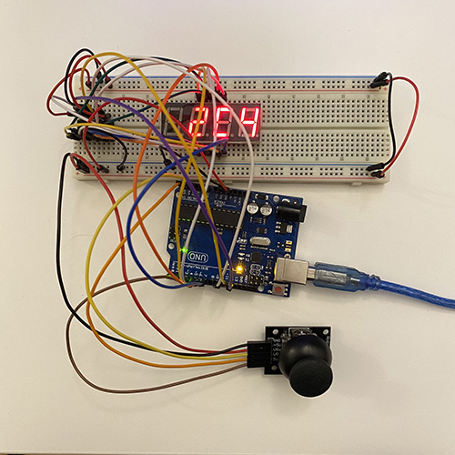
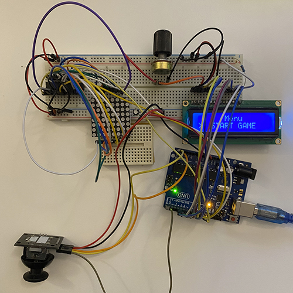

# IntroductionToRobotics

  
 <h3> Homework #1 </h3> 

#### Task:

Use a separat potentiometer in controlling each of the color of the RGB led (Red, Green and Blue). 
The control must be done with digital electronics.

#### Picture

#### Video
[Link to the video!](https://www.youtube.com/watch?v=GDnJiGdQX0s&list=PLMdxOyD8kBYj5SUNuWBl3NmEFGPh_dJIb)

 

  

  
 <h3> Homework #2 </h3> 

#### Task:

Simulate the behaviour of traffic lights for a cross walk.

#### Picture

#### Video
[Link to the video!](https://youtu.be/mJKcgo-BVUo)
  
 

  
 <h3> Homework #3 </h3> 

### Task

The joystick will be used to control the position ofthe segment and draw on the display. The movement between segments should be natural.

The system has the following states:
1. State 1 (default, but also initiated after a button press in State 2): Current position blinking. Can use the joystick to move from one position to neighbors. Short pressing the button toggles state 2. Long pressing the button in state 1 resets the entire display by turning all the segments OFF and moving the current position to the decimal point.
2. State 2 (initiated after a button press in State 1): The  current segment stops blinking, adopting the state of the segment before selection (ON or OFF). Toggling the Y axis should change  the segment state from ON to OFF or from OFF to ON. Clicking the joystick should save the segment state and exit back to state 1.

Long pressing the button to reset should only be available in state 1.

#### Picture

#### Video
[Link to the video!](https://youtu.be/EwdcShFlGiQ)
  
 

 

  
 <h3> Homework #4 </h3> 

### Task

The joystick should be used to move through the 4 digit 7-segment displays digits; the button will be pressed in orded to lock in on the current digit the other axis should be used to increment or decrement the number. Holding button pressed should reset all the digit values and the current position to the first digit in the first state.

1. State 1: a joystick axis  can be used to cycle through the 4 digits; using the other axis does nothing. A blinking decimal point shows the current digit position. When pressing the button, the selected digit is locked in and the second state is entered.
2. State 2: in this state, the decimal point stays always on, no longer blinking and the axis can not longer be used to cycle through the 4 digits. Instead, using the other axis, the number on the current digit IN HEX can be incremented or decremented. Pressing the button again return to the previous state. When changing the number, it can be incremented for each joystick movement - it does not increment continuosly if the joystick is kept in one position.
3. Reset: toggled by long pressing the buttononly in the first state. When resetting, all the digits go back to 0 and the current position is set to the first (rightmost) digit, in the first state.

#### Picture

#### Video
[Link to the video!](https://www.youtube.com/watch?v=XvVE8rHHmII&list=PLMdxOyD8kBYj5SUNuWBl3NmEFGPh_dJIb)
  
 

  
 <h3> Matrix Project </h3> 

### Task

#### Picture

#### Video
  
 

 
 
