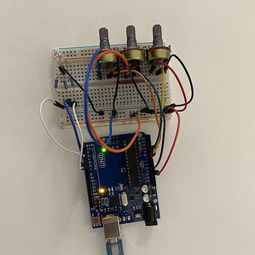

# IntroductionToRobotics

  
 <h3> Homework #1 </h3> 

#### Task:

Use a separat potentiometer in controlling each of the color of the RGB led (Red, Green and Blue). 
The control must be done with digital electronics.

#### Picture

#### Video

 

  

  
 <h3> Homework #2 </h3> 

#### Task:

Simulate the behaviour of traffic lights for a cross walk.

#### Picture

#### Video

  
 

  
 <h3> Homework #3 </h3> 

### Task

The joystick will be used to control the position ofthe segment and draw on the display. The movement between segments should be natural.

The system has the following states:
1. State 1 (default, but also initiated after a button press in State 2): Current position blinking. Can use the joystick to move from one position to neighbors. Short pressing the button toggles state 2. Long pressing the button in state 1 resets the entire display by turning all the segments OFF and moving the current position to the decimal point.
2. State 2 (initiated after a button press in State 1): The  current segment stops blinking, adopting the state of the segment before selection (ON or OFF). Toggling the Y axis should change  the segment state from ON to OFF or from OFF to ON. Clicking the joystick should save the segment state and exit back to state 1.

Long pressing the button to reset should only be available in state 1.

#### Picture

#### Video

  
 

